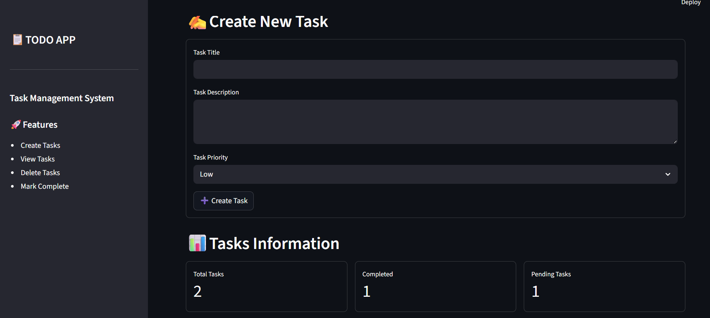
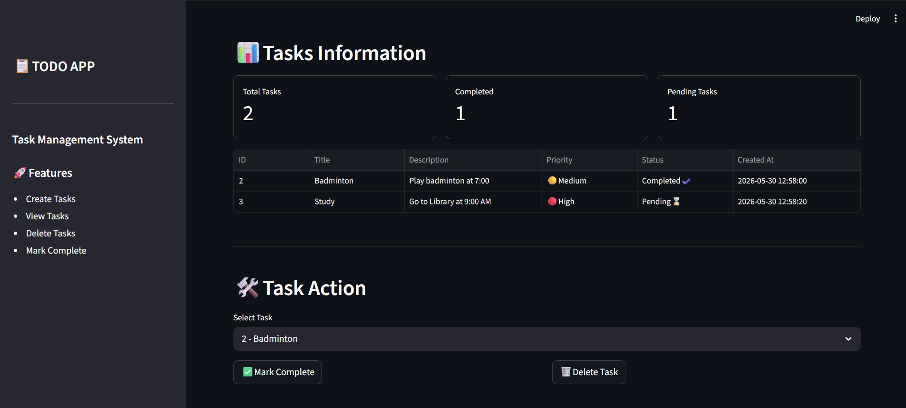
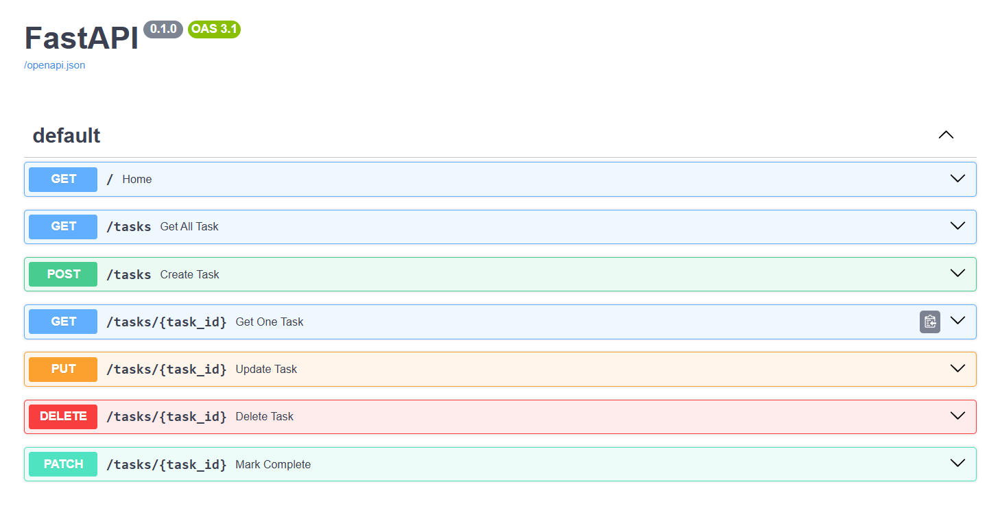

# 📝 Todo Task Manager
A full-stack Task Management application built using **FastAPI**, **MySQL**, **SQLAlchemy**, and **Streamlit**.

## 📸 Screenshots

### Streamlit Dashboard


### Task Management Interface


### FastAPI Swagger Documentation


## 🎥 Demo Video
[▶️ Watch Demo Video](assets/todo_demo.webm)

---

### 🚀 Features
| Backend                | Frontend                   |
| ---------------------- | -------------------------- |
| ➕ Create Task          | 📝 Create Tasks            |
| 📋 Get Tasks           | 📊 Task Dashboard          |
| 🔍 Get Single Task     | 🔴🟡🟢 Priority Indicators |
| ✏️ Update Task         | ✅ Mark Complete            |
| 🗑️ Delete Task        | 🗑️ Delete Task            |
| 🔒 Pydantic Validation | 📈 Task Metrics            |

---

## 🛠️ Tech Stack
| Category   | Technologies        |
| ---------- | ------------------- |
| Backend    | FastAPI, SQLAlchemy |
| Database   | MySQL               |
| Validation | Pydantic            |
| Frontend   | Streamlit           |
| Language   | Python              |

---

## 📂 Project Structure
01_todo_api/
├── app/
│   ├── database/
│   │   ├── connection.py
│   │   └── tables.py
│   │
│   ├── routes/
│   │   └── tasks.py
│   │
│   ├── schema/
│   │   └── task_schema.py
│   │
│   └── main.py
│
├── frontend/
│   └── streamlit_app.py
│
├── .env
├── requirements.txt
└── README.md

---

## 🔗 API Endpoints
| Method | Endpoint      | Description     |
| ------ | ------------- | --------------- |
| POST   | `/tasks`      | Create Task     |
| GET    | `/tasks`      | Get All Tasks   |
| GET    | `/tasks/{id}` | Get Single Task |
| PUT    | `/tasks/{id}` | Update Task     |
| PATCH  | `/tasks/{id}` | Mark Complete   |
| DELETE | `/tasks/{id}` | Delete Task     |

---

## 🔒 Request Validation
Implemented using **Pydantic**.

### Supported Validations
- 📝 Task title minimum length validation
- 📄 Task description minimum length validation
- 🎯 Task priority restricted to:
  - Low
  - Medium
  - High
- 🔍 Type validation for all request fields
- 📚 Automatic API documentation through Swagger UI
- ⚠️ Meaningful validation error messages

---

## ⚙️ Quick Start

### Clone Repository
```bash
git clone https://github.com/vintagevikas090/fastapi-playground.git
cd fastapi-playground/01_todo_api
```

### Install Dependencies
```bash
pip install -r requirements.txt
```

### Run FastAPI
```bash
uvicorn app.main:app --reload
```

### Run Streamlit
```bash
streamlit run frontend/streamlit_app.py
```

---

## 🔑 Environment Variables
```env
DB_USERNAME=your_username
DB_PASSWORD=your_password
DB_HOST=localhost
DB_PORT=3306
DB_NAME=todo_db
```

---

## 📚 What I Learned
* API Development
* CRUD Operations
* SQLAlchemy + MySQL
* Pydantic Validation
* FastAPI Routing
* Streamlit Frontend Development
* Frontend ↔ Backend Integration

---

## 👨‍💻 Author

**Vikas Prajapat**

GitHub: https://github.com/vintagevikas090
